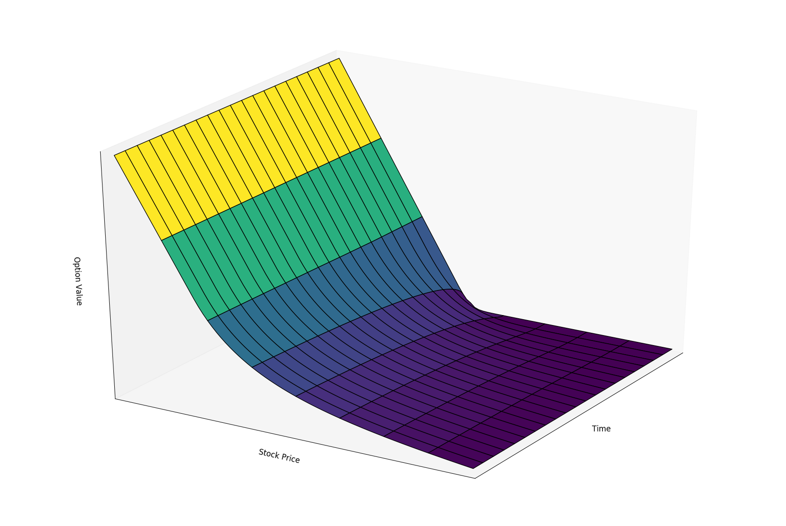

## Description
This repository contains a C++ program that prices American put options with projected SOR method. It originated from Dr. [Aaron D. Saxton](https://www.linkedin.com/in/aaron-d-saxton-phd-60934788)'s assignment. Implementation was done via [GSL](https://www.gnu.org/software/gsl/) 2.1.

## Result
Plotted via Python:  

## References
Peng Liu. [*Numerical Methods For American Option Pricing*](http://eprints.maths.ox.ac.uk/721/). MA thesis. University of Oxford, June 2008. 36 pp.

## Author
Francis Hsu, University of Illinois at Urbana–Champaign.
